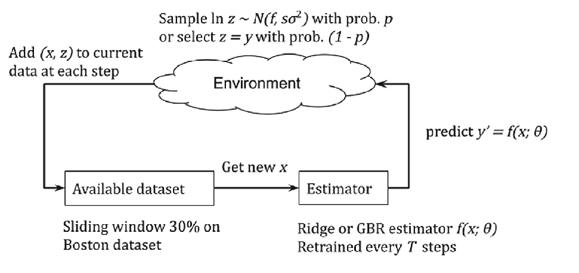

# An MLdev template for simulation experiments in feedback loops

This is a MLdev template for running different feedback loop experiments.
It is based on the [original code](https://github.com/prog-autom/hidden-demo) for the paper named 
"Hidden Feedback Loops in Machine Learning Systems: A Simulation Model and Preliminary Results"

See the source repo and the paper for experiment details.

In this repo we provide just a baseline implementation for you to start with.

## Problem statement

We running the experiment as show at the figure below 



## How to run

There are two experiments included in this repo.

 - single model experiment that demonstrates how housing prices prediction can be solved 
 - hidden loops experiment shows the feedback loop effect as dscribed in the paper

Running the same experiment with [mldev](https://gitlab.com/mlrep/mldev) involves the following steps.

Install the ``mldev`` by executing

```bash
$ curl https://gitlab.com/mlrep/mldev/-/raw/develop/install_mldev.sh -o install_mldev.sh
$ chmod +x install_mldev.sh
$ yes n | install_mldev.sh core
``` 
Then initialize the experiment, this will install required dependencies

```bash
$ mldev init --no-commit -r ./feedback-loops -t https://github.com/prog-autom/template-feedback-loops
```

Detailed description of the experiment can be found in [experiment.yml](./experiment.yml). See docs for [mldev](https://gitlab.com/mlrep/mldev) for details.

And now, run the experiment

```bash
$ cd ./feedback-loops && mldev --config .mldev/config.yaml run --no-commit -f experiment.yml pipeline
```

Results will be placed into [./results](./results) folder.

## Complete experiment with mldev

There is a script [./run_experiment.sh](./run_experiment.sh) that runs the experiment
for a grid of parameters, usage from 0.1 to 0.9, adherence from 0.1 to 0.9 
and step size 10 or 20.

The script relies on mldev to run trials for a fixed set of parameters.

## Source code

Source code can be found in [./src](./src) folder. The [main.py](./src/main.py) file contains glue code to run experiments.
The [experiment.py](./src/experiment.py) contains experiment implementation and utility procedures.
Visualizations are prepared in [results.py](./src/results.py) by aggregating data from the experiment.
A very draft math model is provided in [mathmodel.py](./src/mathmodel.py).

## Things to be done

 - [ ] add a sample iPython notebook 
 - [ ] make the template support arbitrary experiment parameters without rewriting [main.py](./src/main.py)

## Citing

If you find template useful, please cite the original paper as following

```bibtex
@inproceedings{Khritankov2021Hidden,
    title = "Hidden feedback loops in machine learning systems: a simulation model and preliminary results",
    author = "Khritankov, Anton",
    booktitle = "Proceedings of the 13th International Conference, SWQD 2021, Vienna, Austria, January 19–21, 2021",
    year = "2021",
    pages={54--65},
    volume = "404",
    series = "Software Quality: Future Perspectives on Software Engineering Quality",
    publisher = "Springer International Publishing"
}
```

There is an updated version of the paper at [arXiv:2101.05673](https://arxiv.org/abs/2101.05673)

## License

The code is licensed under MIT license, see [LICENSE](LICENSE)


